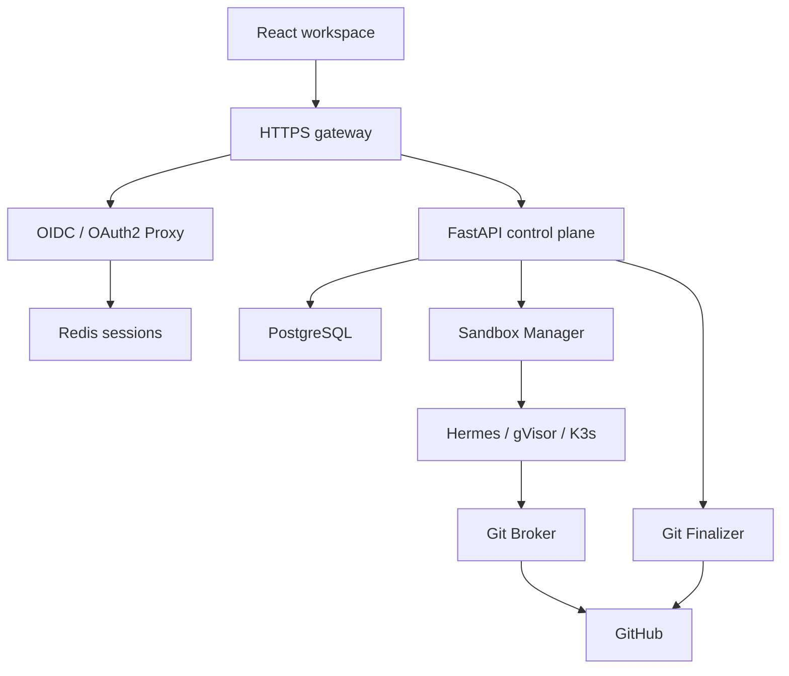

# Keselarasan dengan C4

Frontend tetap berada di atas control plane C4. Tidak ada mesin simulasi atau orchestrator di browser. Workspace, Agent, Task, TaskSession, tenant authorization, runtime Hermes, sandbox, dan delivery tetap menjadi tanggung jawab backend.

Diagram menunjukkan batas tanggung jawab; konfigurasi OIDC masih harus dicocokkan dengan autentikasi runtime C4. Gateway tidak menerbitkan identitas tenant atau memberikan hak akses sendiri.

| Konsep produk                           | Implementasi saat ini                                    | Tanggung jawab server                                                    |
| --------------------------------------- | -------------------------------------------------------- | ------------------------------------------------------------------------ |
| Workspace                               | CRUD melalui endpoint resmi                              | Membership dan tenant authorization                                      |
| Agent                                   | Role, system prompt, model source/ID, repository, status | Provider credential, tool policy, runtime                                |
| Task / run                              | CRUD, queue/start/cancel terpisah                        | TaskSession, concurrency, execution, delivery                            |
| Live Office                             | Proyeksi state dari API; gerakan dekoratif               | Tidak mengubah status task                                               |
| Content Studio                          | Brief menjadi Task yang ditujukan kepada agent           | Kemampuan agent, media generation, external delivery                     |
| Task result                             | result_summary dari TaskRead                             | Generic artifact storage masih perlu ekstensi                            |
| Usage                                   | Entitlements dan harga plan dari API                     | Ledger, metering, penagihan dan pembayaran                               |
| Knowledge / skill / custom sprite       | Belum diaktifkan                                         | Metadata PostgreSQL, blob S3-compatible, index Qdrant, validasi dan izin |
| Workforce packs / schedules / approvals | Belum diaktifkan                                         | Registry, transaksi pack, scheduler, approval terikat versi output       |
| Publishing / connectors                 | Belum diaktifkan                                         | OAuth/provider credentials, scopes, delivery audit dan idempotency       |

Tidak semua pekerjaan non-kode memerlukan repository/worktree. Pemilihan repository tetap opsional di AgentCreate; kemampuan runtime untuk jenis pekerjaan tersebut harus diuji terhadap backend sebenarnya.

Sumber penilaian: arsip konsep yang tersedia pada sesi sebelumnya, dokumentasi backend yang tersedia, dan [OpenAPI canonical 09fcaccc](https://github.com/arumora-id/api.mesthi.com/blob/09fcaccc449d09456026de90dc2665ddcb5e32ce/openapi/openapi.json). Dua percakapan privat belum terbaca seluruhnya. Penilaian ini tidak mengklaim audit lengkap kedua percakapan ataupun validasi deployment backend.

C4 dalam arsip juga mencakup milestone operasional C4/C4.4–C4.8. Rencana hardening C4.5 tidak diasumsikan sudah aktif. Perbedaan metadata OpenAPI 1.12.1 dan catatan image 1.12.2 tetap perlu diverifikasi pada deployment API.
