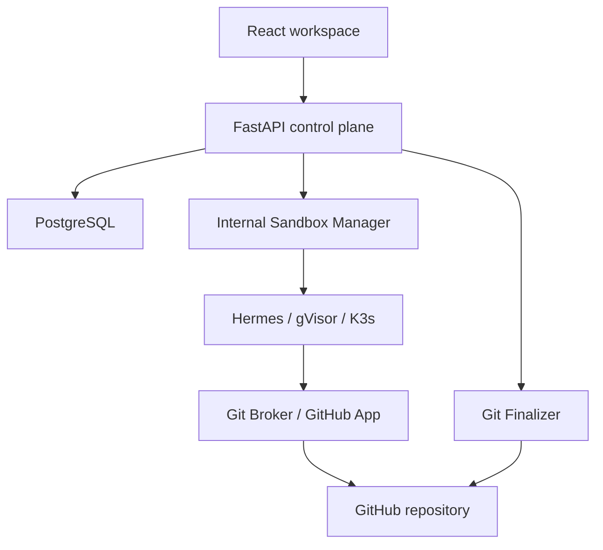

# Keselarasan konsep produk dengan C4

## Kesimpulan

Konsep autonomous workspace masih selaras dengan C4 bila diperlakukan sebagai perluasan produk di atas control plane yang ada. Task, TaskSession, tenant authorization, sandbox, dan delivery tetap menjadi tanggung jawab backend. Frontend menambahkan cara membuat brief, menyusun tim, memantau pekerjaan, dan meninjau hasil.

Dalam arsip arsitektur yang diperiksa, C4 juga merujuk pada milestone operasional C4/C4.4–C4.8. Status rencana seperti hardening dokumentasi/admin di C4.5 tidak dianggap otomatis sudah diterapkan.

## Dasar pemeriksaan

- Arsip proposal workforce packs, billing, dan produk yang tersedia dalam sesi.
- README arsitektur `api.mesthi.com` yang tersedia dalam sesi.
- [OpenAPI canonical](https://github.com/arumora-id/api.mesthi.com/blob/09fcaccc449d09456026de90dc2665ddcb5e32ce/openapi/openapi.json), info version 1.12.1.
- Dua tautan percakapan privat tidak dapat diakses secara lengkap. Penilaian ini terbatas pada dokumen dan kontrak tersebut.

Perbedaan versi image 1.12.2 dan APP_VERSION/OpenAPI 1.12.1 yang disebut README tidak diselesaikan atau diubah oleh frontend ini.

## Batas sistem

Diagram merangkum tanggung jawab dan dependensi, bukan kontrak jaringan baru. Browser hanya mengakses control plane melalui reverse proxy. Akses tenant, credential provider, dan kredensial GitHub harus tetap diverifikasi di backend.

## Pemetaan produk

| Konsep produk | Padanan C4 / keputusan | Implementasi frontend |
| --- | --- | --- |
| Workspace | Batas produk dengan otorisasi tenant di backend | Switch workspace dan pemisahan state; API memakai workspace yang diizinkan |
| Agent | Agent C4 dengan role, model, dan konfigurasi repository | Daftar/detail serta create Agent melalui kontrak resmi |
| Mission / run | Tampilan atas Task; TaskSession adalah satu percobaan eksekusi | Tidak membuat orchestrator alternatif |
| Workflow | Template langkah yang akhirnya menghasilkan Task | Simulasi lokal; katalog dan scheduler server perlu ekstensi |
| Workforce pack | Agent Templates + Skills/Skill Packs + Workflow Templates | Instalasi atomik lokal; API memerlukan endpoint transaksi backend |
| Live Office | Proyeksi visual state workspace | Phaser membaca store bersama; gerakan dekoratif tidak mengubah eksekusi |
| Content Studio | Jenis pekerjaan tambahan di atas lifecycle task | Brief dan storyboard demo; provider media/publishing belum dihubungkan |
| Skill markdown | Dokumen kemampuan yang harus divalidasi sebelum eksekusi | Disimpan sebagai teks; tidak memberi izin tool |
| Output | Hasil pekerjaan; bukti Git delivery khusus pekerjaan kode | Demo markdown; result_summary C4 tampil di task; artifact API umum perlu ekstensi |
| Approval | Keputusan manusia terikat artefak, tujuan, dan aksi | Demo review; general approval API belum tersedia |
| Usage / billing | Entitlements dan ledger otoritatif di backend | Entitlements C4 dibaca; anggaran/reservasi demo terpisah |
| BYOK | Model source; platform tetap menanggung biaya non-inference | Tidak menganggap BYOK berarti seluruh platform gratis |

## Lifecycle dan delivery

Frontend membedakan `draft`, `queued`, `running`, `delivering`, `completed`, `cancelled`, dan `failed`. Status backend yang belum dikenal tampil sebagai **Unknown**, tidak dianggap berhasil.

Create Task, queue, dan start adalah tindakan terpisah. `TaskRead` pada kontrak yang diperiksa tidak menyertakan task_session_id, commit SHA, remote SHA, atau Hermes status. UI menandai data itu **Not exposed**. Endpoint reconcile yang memerlukan task_session_id tidak dipanggil otomatis atau ditebak parameternya.

Kelengkapan delivery tetap ditentukan backend, termasuk pemeriksaan Hermes, commit, dan remote SHA. Tidak semua task non-kode memerlukan repository atau worktree; artifact delivery umum memerlukan kontrak tambahan.

## Urutan perluasan yang relevan

1. Integrasi autentikasi produksi dan penguatan tenant/role pada setiap aksi.
2. Pack/template API atomik dengan versi dan validasi policy.
3. Skill registry, knowledge, generic artifacts, dan binding output ke TaskSession.
4. Approval API yang mengikat versi output, destination, action, dan keputusan manusia; idempotency untuk external delivery.
5. Provider adapters, OAuth/MCP, media generation, scheduler, dan metering otoritatif.
6. Marketplace berbayar dan office builder setelah fondasi task serta billing stabil.

MVP mempertahankan Free + Pro sebagai proposal. Harga dan kuota final harus ditetapkan bersama model biaya; frontend ini tidak membuat langganan atau biaya nyata.
